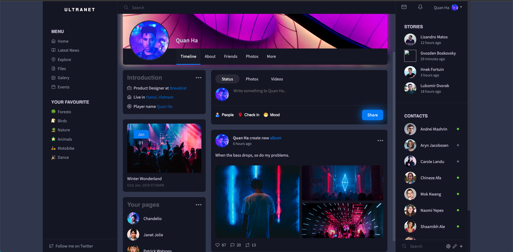

# social-network-ui

A sample builds a home page in social network.

## Components

In the sample, we use two programming languages to build a web page ui:

- HTML
- CSS

Beside, to simplify implement a CSS file, we use [sass](https://sass-lang.com/). Sass is the most feature, stable and powerful professional grade CSS extension language in the world.

To install sass, we can see in the [sass install](https://sass-lang.com/install) homepage.

When sass is installed on the computer, we can able to compile a `.sass` or `.scss` file into a `.css` file:

    sass path_to_sass_file path_to_css_file --watch

Option `--watch` helps the compiled `.css` file know each time `.sass` file changes.

We use [Source Sans Pro](https://fonts.google.com/specimen/Source+Sans+Pro?query=source+san+) in the Google font collection.

## Screenshot

